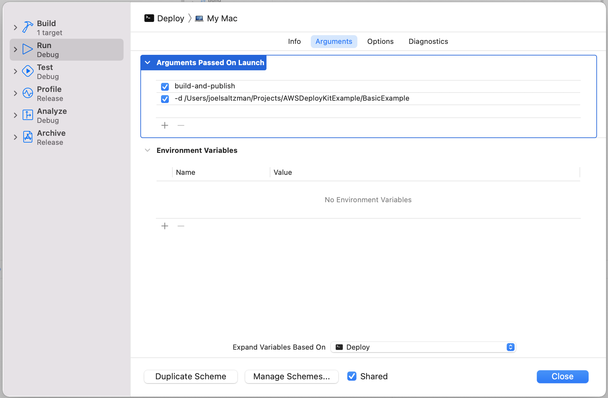

# Simple Example

An example of how to use [aws-deploy-kit](https://github.com/saltzmanjoelh/aws-deploy-kit) within an Xcode project.

## TLDR

Take a look at the `Deploy` target. The target will need some launch arguments. Edit the scheme by pressing cmd + shift + < and selecting the the `Deploy` target. Switch to the "Arguments" tab, then set the "Arguments Passed on Launch" as `build-and-publish -d /path/to/AWSDeployKitExample`.



## Setup
Here are the detailed steps to setup a project like this.

### Create Your Package

* Create a new directory called `example-lambda`.
* `cd` into it.
* Create a new executable Swift package by specifying `--type executable`.
* Add a directory for the `Deploy` source code and create it's `main.swift` file.
* Open the project.

```shell
mkdir example-lambda && \
cd example-lambda && \
swift package init --type executable && \
mkdir Sources/Deploy && \
touch Sources/Deploy/main.swift && \
open Package.swift
```

The minimum platform must be specified in the package manifest. Add this to it:

```swift
platforms: [
    .macOS(.v10_12)
],
```

### Lambda Target

At the top of the Package.swift manifest, create the executable product that will be used for the Lambda function. We are calling it `example-lambda`. The products section was not created for us, do that now.  

```swift
products: [
    .executable(
        name: "example-lambda",
        targets: ["example-lambda"]
    ),
],
```

Add the Swift AWS Lambda related dependencies

```swift
dependencies: [
    .package(url: "https://github.com/swift-server/swift-aws-lambda-runtime.git", .branch("main")),
],
```

Update the `example-lambda` target at the bottom with the Swift AWS Lambda related dependencies

```swift
targets: [
    .target(
        name: "example-lambda",
        dependencies: [
            .product(name: "AWSLambdaRuntime", package: "swift-aws-lambda-runtime"),
        ]),
]
```

### Deployment Target

The `Deploy` target is the main point of this example project. Add `AWSDeployKit` as a dependency. The dependencies section should now contain all these packages:

```swift
dependencies: [
    // Existing
    .package(url: "https://github.com/swift-server/swift-aws-lambda-runtime.git", .branch("main")),
    // Add this one
    .package(url: "https://github.com/saltzmanjoelh/aws-deploy-kit", .branch("main")),
],
```

The final setup of setting up the package manifest is to add the `Deploy` target. It doesn't need an entry in the products section. The targets section should now look like this:

```swift
targets: [
    // Existing
    .target(
        name: "example-lambda",
        dependencies: [
            .product(name: "AWSLambdaRuntime", package: "swift-aws-lambda-runtime"),
        ]),
    // Add this one
    .target(
        name: "Deploy",
        dependencies: [
            .product(name: "AWSDeployCore", package: "aws-deploy-kit"),
        ]),
]
```

Your package manifest is done. It should look like the [Package.swift](Package.swift) manifest that was provided in this repo. 

## example-lambda Source Code

Let's add some minimal code to our Lamdba function. Replace the entire contents of `Sources/example-lambda/main.swift` with this:

```swift

 struct Request: Codable {
    let name: String
 }
 struct Response: Codable {
    let message: String
 }

struct ExampleHandler: EventLoopLambdaHandler {
    typealias In = Request
    typealias Out = Response
    
    func handle(event: Request, context: Lambda.Context) -> EventLoopFuture<Response> {
        context.eventLoop.makeSucceededFuture(Response(message: "Hello, \(event.name)"))
    }
}
 ```

 ## Deploy Source Code
 
 It doesn't take much to make the `Deploy` source code. The `Sources/Deploy/main.swift` file should be empty. Simply paste this in there:

 ```swift
 import Foundation
 import AWSDeployCore

 AWSDeployCommand.main() // This will parse your "Arguments Passed On Launch" in the Edit Scheme window

```

### Launch Arguments

* Switch your selected target in Xcode to `Deploy`.
* Press `cmd` + `shift` + `<` to edit the scheme.
* Add the `build-and-publish` command in the "Arguments Passed On Launch" section
* Add the path to this project in the "Arguments Passed On Launch" section `-d /path/this/project/`. 
* Make sure that Docker is running
* Run the `Deploy` target. It will build and publish to AWS Lambda


You can take a look at the full list help by running `aws-deploy --help`. It's also listed [in the repo](https://github.com/saltzmanjoelh/aws-deploy-kit/blob/main/README.md).

You can either explicity choose which executable to build (`example-lambda`) or let it build all of them, skipping the currently running executable (In our case the Deploy target). Since this example project has only one target other than the `Deploy` target (`example-lambda`), it will only publish that one. So, we could leave the target out of the run arguments.


## Build and Publish

With the `Deploy` target selected, run it! You should see the Xcode console start building and deploying. On the first run, the Lambda will be created along with a role that uses the AWSLambdaBasicExecutionRole, and a `development` alias. Future deployments will update the `example-lambda` code and point the `development` alias to the latest version.


## Test

You can invoke your newly updated Lambda

Simply disable the "Arguments Passed On Launch" and add

`aws-deploy invoke example-lambda '{"name": "Something Else!"}'`

```shell
aws lambda invoke --function-name example-lambda \
  --cli-binary-format raw-in-base64-out \
  --payload '{ "name": "Bob" }' \
  output.txt
cat output.txt
```

